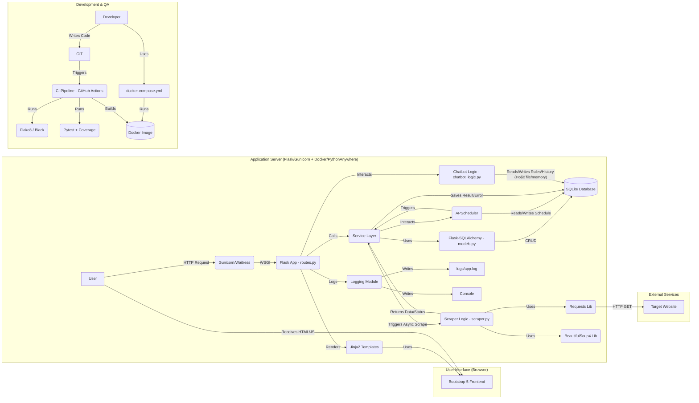

# Tài liệu Yêu cầu Sản phẩm (PRD) - Web Scraping Bot Nâng cao

**Phiên bản:** 2.0

**Ngày tạo:** 17/4/2025

## 1. Giới thiệu

Dự án này nhằm xây dựng một ứng dụng web cho phép người dùng định nghĩa, quản lý, thực thi (thủ công hoặc tự động theo lịch) và giám sát các tác vụ **Web Scraping** (thu thập dữ liệu tự động từ các trang web). Ứng dụng cung cấp một giao diện đồ họa trực quan, hiện đại và responsive để người dùng dễ dàng cấu hình chi tiết các tác vụ (bao gồm URL mục tiêu và các bộ chọn dữ liệu cụ thể - CSS Selector), theo dõi tiến trình, xem/xuất kết quả thu thập được.

Mục đích chính là tạo ra một công cụ mạnh mẽ và linh hoạt, không chỉ phục vụ cho việc học tập và trình bày trong khuôn khổ Bài tập lớn môn Phát triển ứng dụng với Python mà còn thể hiện khả năng áp dụng các kỹ thuật nâng cao như chạy tác vụ nền, lập lịch, đóng gói ứng dụng (Docker) và đảm bảo chất lượng mã nguồn (Testing, Logging). Ứng dụng cũng tích hợp một chatbot hướng dẫn cơ bản (được xây dựng cẩn thận để tránh các vấn đề của thư viện cũ) để hỗ trợ người dùng.

## 2. Mục tiêu Sản phẩm

*   **MT1:** Xây dựng giao diện web **sạch sẽ, hiện đại, responsive, dễ sử dụng** cho phép quản lý toàn diện các tác vụ scraping.
*   **MT2:** Cung cấp chức năng **cốt lõi và mở rộng** để tạo, cấu hình (với CSS Selector), chạy (thủ công & lập lịch), xem trạng thái, xem kết quả, tìm kiếm và phân trang danh sách tác vụ.
*   **MT3:** Cho phép **xuất dữ liệu** đã scrape ra định dạng file **CSV**.
*   **MT4:** Tích hợp một **chatbot đơn giản, ổn định** (sử dụng cơ chế Rule-Based tự xây dựng hoặc phiên bản ChatterBot được kiểm soát chặt chẽ) để trả lời các câu hỏi cơ bản về cách sử dụng ứng dụng.
*   **MT5:** Đảm bảo kiến trúc và công nghệ sử dụng **hiện đại, dễ hiểu, dễ bảo trì và mở rộng** (Flask, SQLAlchemy, APScheduler, Requests/BeautifulSoup, kiến trúc có Service Layer).
*   **MT6:** Triển khai ứng dụng lên một nền tảng web hosting **dễ sử dụng** (PythonAnywhere) VÀ đóng gói ứng dụng bằng **Docker** để đảm bảo tính nhất quán và di động.
*   **MT7:** Đạt được các tiêu chí cần thiết để **nhắm tới mục tiêu điểm 9/10 trở lên** theo rubric của môn học, thể hiện sự vượt trội so với yêu cầu cơ bản.
*   **MT8:** Implement các **chức năng mở rộng đáng kể** so với yêu cầu ban đầu, cụ thể là khả năng **cấu hình scraping linh hoạt (CSS Selectors)** và **lập lịch chạy tác vụ tự động (Scheduling)**.
*   **MT9:** Đảm bảo **chất lượng mã nguồn cao** thông qua việc viết **Unit Test** (với coverage tối thiểu 80%) và triển khai hệ thống **Logging** chi tiết.
*   **MT10:** **Đóng gói ứng dụng** bằng **Docker** và cung cấp `Dockerfile`, `docker-compose.yml` để dễ dàng build và chạy môi trường độc lập.
*   **MT11:** Thiết lập một **pipeline CI/CD cơ bản** (ví dụ: sử dụng GitHub Actions) để tự động chạy test và build Docker image khi có thay đổi mã nguồn.

## 3. Đối tượng người dùng

*   **Sinh viên:** Người trực tiếp thực hiện dự án, cần hiểu rõ cách xây dựng, hoạt động, kiểm thử và triển khai ứng dụng.
*   **Giảng viên:** Người đánh giá dự án, cần thấy được sự hoàn chỉnh, các tính năng mở rộng đáp ứng yêu cầu điểm 9+, chất lượng mã nguồn, khả năng đóng gói (Docker), triển khai và sự hiểu biết sâu sắc của sinh viên về dự án.

## 4. Luồng người dùng (User Flow)

Khi người dùng truy cập vào địa chỉ web của ứng dụng, họ sẽ được đưa đến trang **Dashboard chính** mà không cần đăng nhập. Giao diện chính bao gồm một **Thanh điều hướng bên trái (Sidebar)** cố định và một **Vùng nội dung chính (Main Content Area)**. Sidebar chứa các liên kết: **"Dashboard"**, **"Tạo tác vụ mới"**, **"Danh sách tác vụ"**, và **"Hỏi Đáp Chatbot"**.

Mặc định, trang **Dashboard** được hiển thị trong Vùng nội dung chính, cung cấp cái nhìn tổng quan nhanh với các thẻ thống kê (Tổng số tác vụ, Số tác vụ hoàn thành, Số tác vụ đang chạy, Số tác vụ lỗi, v.v.) và một nút lớn **"+ Tạo tác vụ Scraping mới"**.

Nhấn vào **"Tạo tác vụ mới"** trên Sidebar hoặc nút **"+ Tạo tác vụ Scraping mới"** trên Dashboard sẽ tải trang tạo tác vụ vào Vùng nội dung chính. Trang này có một form chi tiết hơn:
*   **"Tên tác vụ"** (ô input text, bắt buộc).
*   **"URL mục tiêu"** (ô input url, bắt buộc, có validation).
*   **"Cấu hình Selectors"**: Một khu vực cho phép người dùng thêm nhiều cặp "Tên dữ liệu" (ví dụ: "Tiêu đề bài viết", "Giá sản phẩm") và "CSS Selector" tương ứng (ô input text, bắt buộc cho mỗi cặp). Có nút "Thêm Selector" để thêm dòng mới và nút "Xóa" cho mỗi dòng.
*   **"Cấu hình Lập lịch" (Tùy chọn)**: Các tùy chọn để thiết lập lịch chạy tự động (ví dụ: chọn "Không lập lịch", "Chạy mỗi X giờ", "Chạy hàng ngày vào lúc Y giờ").
Người dùng điền thông tin và nhấn nút **"Lưu tác vụ"**. Hệ thống sẽ kiểm tra dữ liệu (validation phía server), lưu tác vụ mới (bao gồm cả cấu hình selectors và lịch trình) vào cơ sở dữ liệu SQLite với trạng thái **"Đang chờ" (Pending)**, sau đó tự động chuyển hướng người dùng đến trang **"Danh sách tác vụ"** và hiển thị thông báo thành công (toast notification). Nếu có lỗi validation hoặc lỗi lưu, thông báo lỗi chi tiết sẽ hiển thị trên form.

Nhấn vào **"Danh sách tác vụ"** trên Sidebar sẽ hiển thị một bảng (HTML `<table>`) trong Vùng nội dung chính, liệt kê tất cả tác vụ. Bảng này có **phân trang (pagination)** nếu số lượng tác vụ lớn và một **ô tìm kiếm (search)** để lọc tác vụ theo tên. Các cột bao gồm: **ID**, **Tên tác vụ**, **URL mục tiêu**, **Trạng thái** ("Đang chờ", "Đang chạy", "Hoàn thành", "Lỗi", "Đang lập lịch"), **Lịch trình**, **Thời gian tạo**, **Lần chạy cuối**, và **Hành động**. Cột Hành động chứa các nút:
*   **"Chạy ngay"**: Hiển thị khi trạng thái là "Đang chờ" hoặc "Hoàn thành" hoặc "Lỗi". Nhấn nút này sẽ kích hoạt quá trình scraping **bất đồng bộ** (ví dụ: chạy trong background thread) cho tác vụ đó. Giao diện sẽ hiển thị một chỉ báo **loading (spinner)** và trạng thái tác vụ cập nhật thành **"Đang chạy"**. Nút "Chạy ngay" bị vô hiệu hóa tạm thời. Sau khi hoàn tất, trạng thái cập nhật thành **"Hoàn thành"** hoặc **"Lỗi"** và có thể có thông báo toast.
*   **"Xem kết quả"**: Hiển thị khi trạng thái là "Hoàn thành". Nhấn nút này sẽ chuyển đến trang xem chi tiết kết quả.
*   **"Xem lỗi"**: Hiển thị khi trạng thái là "Lỗi". Nhấn vào sẽ hiển thị chi tiết lỗi (ví dụ: trong modal hoặc trang riêng).
*   **"Sửa"**: Cho phép chỉnh sửa thông tin tác vụ (tên, URL, selectors, lịch trình).
*   **"Xóa"**: Hiển thị cho mọi trạng thái. Nhấn nút này sẽ hiển thị hộp thoại xác nhận, nếu đồng ý, tác vụ sẽ bị xóa.

Khi nhấn nút **"Xem kết quả"**, Vùng nội dung chính sẽ hiển thị trang chi tiết kết quả. Trang này bao gồm tiêu đề, thông tin tóm tắt tác vụ, một nút **"Tải xuống CSV"**, và dữ liệu scrape được trình bày dưới dạng **bảng HTML** dựa trên các "Tên dữ liệu" và dữ liệu tương ứng đã lấy được theo selectors. Nhấn nút "Tải xuống CSV" sẽ kích hoạt việc tải về file CSV chứa dữ liệu của tác vụ đó.

Nhấn vào **"Hỏi Đáp Chatbot"** trên Sidebar sẽ tải giao diện chatbot vào Vùng nội dung chính. Giao diện này có một ô nhập liệu để người dùng gõ câu hỏi và một khu vực hiển thị lịch sử hội thoại giữa người dùng và bot. Bot được huấn luyện (hoặc lập trình quy tắc) để trả lời các câu hỏi cơ bản về cách sử dụng ứng dụng (ví dụ: "Làm sao để tạo task với selector?", "Lập lịch chạy task thế nào?", "Xem kết quả ở đâu?").

## 5. Yêu cầu Chức năng (Functional Requirements - FR)

*   **FR1: Quản lý Tác vụ Scraping (CRUD & More):**
    *   **FR1.1:** Tạo tác vụ scraping mới với Tên (text, bắt buộc), URL mục tiêu (url, bắt buộc, validated), cấu hình CSS Selectors (ít nhất một cặp Tên dữ liệu - Selector, bắt buộc), và cấu hình Lập lịch (tùy chọn).
    *   **FR1.2:** Lưu trữ thông tin tác vụ (ID, Tên, URL, Selectors (JSON), Lịch trình, Trạng thái, Thời gian tạo, Thời gian cập nhật, Lần chạy cuối, Kết quả (JSON), Thông tin lỗi) vào cơ sở dữ liệu SQLite.
    *   **FR1.3:** Hiển thị danh sách tất cả các tác vụ đã tạo dưới dạng bảng, hỗ trợ **phân trang (pagination)** và **tìm kiếm/lọc (search/filter)** theo tên tác vụ.
    *   **FR1.4:** Chỉnh sửa thông tin chi tiết của một tác vụ đã tồn tại.
    *   **FR1.5:** Xóa tác vụ khỏi hệ thống (kèm xác nhận).

*   **FR2: Thực thi Tác vụ Scraping:**
    *   **FR2.1:** Kích hoạt chạy tác vụ scraping thủ công (nhấn nút "Chạy ngay").
    *   **FR2.2:** Thực thi tác vụ scraping **bất đồng bộ** (ví dụ: sử dụng background thread hoặc `APScheduler` job) để không chặn giao diện người dùng. Cung cấp **phản hồi trực quan (spinner)** trong quá trình chạy. Áp dụng **timeout** hợp lý cho request HTTP.
    *   **FR2.3:** Tự động thực thi các tác vụ đã được **lập lịch** (sử dụng `APScheduler` hoặc tương đương).
    *   **FR2.4:** Cập nhật trạng thái tác vụ một cách chính xác: "Đang chờ" (Pending), "Đang chạy" (Running), "Hoàn thành" (Completed), "Lỗi" (Failed), "Đang lập lịch" (Scheduled).
    *   **FR2.5:** **Xử lý lỗi chi tiết:** Bắt các lỗi phổ biến (Connection Timeout, Connection Error, HTTP Status Code Error 4xx/5xx, Selector Not Found Error, Parsing Error). Ghi log chi tiết lỗi. Lưu thông điệp lỗi chính vào trường `error_message` của tác vụ trong DB. Cập nhật trạng thái thành "Lỗi". Cung cấp cách xem chi tiết lỗi cho người dùng.

*   **FR3: Xem và Xuất Kết quả:**
    *   **FR3.1:** Lưu trữ kết quả scraping (dưới dạng chuỗi JSON, có cấu trúc rõ ràng dựa trên các selectors người dùng định nghĩa, ví dụ: `{"Tên dữ liệu 1": "giá trị 1", "Tên dữ liệu 2": ["giá trị 2a", "giá trị 2b"]}`) vào cơ sở dữ liệu khi tác vụ hoàn thành.
    *   **FR3.2:** Hiển thị kết quả scraping của một tác vụ đã hoàn thành dưới dạng bảng HTML trên giao diện web, với các cột tương ứng với "Tên dữ liệu" đã định nghĩa.
    *   **FR3.3:** Cho phép người dùng tải xuống kết quả scraping dưới dạng file **CSV**, với header là các "Tên dữ liệu".

*   **FR4: Chatbot Hướng dẫn:**
    *   **FR4.1:** Cung cấp giao diện chatbot đơn giản (ô nhập, vùng hiển thị hội thoại).
    *   **FR4.2:** Sử dụng cơ chế **Rule-Based tự xây dựng** đơn giản HOẶC phiên bản **ChatterBot cụ thể (ví dụ: 1.0.4)** với lưu ý về tình trạng không còn bảo trì và các giải pháp thay thế tiềm năng (workaround) nếu gặp lỗi SQLite. *Quyết định: Ưu tiên Rule-Based tự xây dựng để đảm bảo ổn định.*
    *   **FR4.3:** Xây dựng bộ quy tắc hoặc dữ liệu huấn luyện (nếu dùng ChatterBot) để trả lời các câu hỏi thường gặp về cách sử dụng các chức năng chính và mở rộng của ứng dụng (tạo task, selectors, lập lịch, xem kết quả/lỗi). Cung cấp ví dụ về các cặp hỏi-đáp trong tài liệu.

*   **FR5: Cấu hình Scraping Linh hoạt:**
    *   **FR5.1:** Giao diện cho phép người dùng định nghĩa động các cặp **Tên Dữ liệu** và **CSS Selector** tương ứng khi tạo hoặc sửa tác vụ.
    *   **FR5.2:** Logic scraping sử dụng các selectors này để trích xuất dữ liệu từ HTML của URL mục tiêu.

*   **FR6: Lập lịch Tác vụ (Task Scheduling):**
    *   **FR6.1:** Giao diện cho phép người dùng chọn các tùy chọn lập lịch (không, mỗi X giờ, hàng ngày vào giờ Y).
    *   **FR6.2:** Sử dụng thư viện như `APScheduler` để quản lý và kích hoạt các tác vụ theo lịch đã định.

## 6. Yêu cầu Phi chức năng (Non-Functional Requirements - NFR)

*   **NFR1: Hiệu năng:**
    *   Thời gian phản hồi của giao diện web phải nhanh chóng cho các thao tác thông thường (< 1 giây).
    *   Thực thi scraping chạy nền (asynchronous) để không làm treo UI.
    *   Áp dụng timeout (ví dụ: 30 giây) cho các HTTP request khi scraping.
*   **NFR2: Dễ sử dụng (Usability):**
    *   Giao diện người dùng phải trực quan, dễ hiểu, dễ thao tác.
    *   Thiết kế **Responsive**, hoạt động tốt trên cả desktop và các thiết bị di động phổ biến.
    *   Cung cấp phản hồi trực quan rõ ràng: thông báo thành công/lỗi (toast notifications), chỉ báo trạng thái đang tải/chạy (spinners).
*   **NFR3: Bảo mật:**
    *   Không yêu cầu đăng nhập/xác thực (để đơn giản hóa BTL).
    *   Thực hiện **validation và sanitization** cơ bản cho các dữ liệu đầu vào từ người dùng (đặc biệt là URL, các selector) để tránh các lỗi không mong muốn hoặc lỗ hổng cơ bản (ví dụ: sử dụng `validators.url`, `Flask-WTF`).
    *   **Thoát (escape)** dữ liệu trước khi hiển thị trên HTML để tránh XSS cơ bản.
    *   *Lưu ý:* Mức độ bảo mật này là tối thiểu, phù hợp với BTL, không đủ cho ứng dụng thực tế.
*   **NFR4: Khả năng bảo trì (Maintainability):**
    *   Code cần được tổ chức rõ ràng, tuân theo cấu trúc dự án Flask chuẩn, áp dụng các nguyên tắc SOLID ở mức độ cơ bản.
    *   Sử dụng **Service Layer** để tách biệt business logic khỏi route handlers.
    *   Áp dụng **code linting (Flake8)** và **code formatting (Black)** để đảm bảo code sạch sẽ, nhất quán.
    *   Viết **comment** giải thích các phần logic phức tạp hoặc quan trọng.
*   **NFR5: Khả năng triển khai (Deployability):**
    *   Ứng dụng phải có khả năng triển khai dễ dàng lên nền tảng **PythonAnywhere**.
    *   Ứng dụng phải được **đóng gói bằng Docker** (`Dockerfile`, `docker-compose.yml`) để đảm bảo môi trường chạy nhất quán và dễ dàng triển khai trên các nền tảng hỗ trợ Docker.
*   **NFR6: Logging:**
    *   Triển khai hệ thống logging toàn diện sử dụng module `logging` của Python.
    *   Log các sự kiện quan trọng: khởi động/dừng ứng dụng, tạo/sửa/xóa task, bắt đầu/kết thúc/lỗi khi chạy task, các lỗi không mong muốn.
    *   Log ra cả **console** (cho development) và **file** (cho production), sử dụng **RotatingFileHandler** để quản lý kích thước file log.
    *   Định dạng log rõ ràng, bao gồm timestamp, level, module, message.
*   **NFR7: Testing:**
    *   Viết **Unit Test** cho các thành phần quan trọng (ví dụ: models, services, utility functions, logic scraping cơ bản) sử dụng framework `pytest`.
    *   Đạt **tỷ lệ bao phủ mã nguồn (code coverage) tối thiểu 80%** được đo bằng `pytest-cov`.
    *   Tích hợp chạy test vào quy trình phát triển và CI/CD.
*   **NFR8: Configuration Management:**
    *   Sử dụng file `.env` và thư viện `python-dotenv` để quản lý các biến môi trường và cấu hình nhạy cảm (SECRET_KEY, đường dẫn DB, cấu hình API key nếu có). File `.env` không được commit vào Git.

## 7. Yêu cầu Giao diện Người dùng (UI/UX)

*   **UI1:** Giao diện web **sạch sẽ, hiện đại, responsive** (ưu tiên mobile-first nếu có thể).
*   **UI2:** Sử dụng thư viện **Bootstrap 5** để xây dựng layout, components (nút bấm, form, bảng, thẻ, sidebar, modal, toast, spinner) và đảm bảo tính thẩm mỹ, nhất quán.
*   **UI3:** Bố cục chính gồm **Sidebar cố định bên trái** và **Vùng nội dung chính**.
*   **UI4:** Sử dụng màu sắc hài hòa, font chữ dễ đọc.
*   **UI5:** Cung cấp phản hồi trực quan cho người dùng: **toast notifications** cho các hành động thành công/lỗi, **spinners** khi thực hiện tác vụ nền (chạy scraping), **validation messages** rõ ràng trên form.
*   **UI6:** Giao diện Chatbot đơn giản, thân thiện.
*   **UI7:** Bổ sung các thành phần UI cho tính năng mới:
    *   Form nhập liệu động cho CSS Selectors (thêm/xóa dòng).
    *   Các tùy chọn lập lịch (dropdown, input thời gian).
    *   Điều khiển phân trang (pagination controls) cho bảng danh sách tác vụ.
    *   Ô tìm kiếm (search input) cho bảng danh sách tác vụ.
    *   Modal hoặc khu vực hiển thị chi tiết lỗi.
*   **UI8:** (Tùy chọn, điểm cộng) Cung cấp chức năng chuyển đổi **Dark Mode/Light Mode**.

## 8. Kiến trúc Hệ thống

*   **Kiến trúc Monolithic:** Toàn bộ ứng dụng được đóng gói và chạy như một tiến trình duy nhất (hoặc vài tiến trình nếu dùng Gunicorn workers).
*   **Framework:** Sử dụng **Flask** làm web framework chính.
*   **Pattern:** Áp dụng **Service Layer** để tách biệt business logic khỏi `routes.py`. Sử dụng **Repository Pattern** (thông qua Flask-SQLAlchemy ORM) để tương tác với DB.
*   **Database:** Sử dụng **SQLite** để lưu trữ dữ liệu (dễ dàng cho BTL và deploy trên PythonAnywhere).
*   **Scraping Execution:** Thực thi **bất đồng bộ (asynchronous)** sử dụng **APScheduler** chạy trong cùng tiến trình Flask (đơn giản) hoặc **Celery** (mạnh mẽ hơn, tùy chọn nâng cao). *Quyết định: Sử dụng APScheduler tích hợp.*
*   **Task Scheduling:** Sử dụng **APScheduler** để quản lý và thực thi các tác vụ định kỳ.
*   **Logging:** Tích hợp module `logging` chuẩn của Python.
*   **Testing:** Sử dụng `pytest` cho unit testing.
*   **Deployment:** Hỗ trợ triển khai trực tiếp lên **PythonAnywhere** và đóng gói bằng **Docker**.



*Sơ đồ kiến trúc cập nhật thể hiện Service Layer, APScheduler, Logging, Testing, Docker và CI.*

## 9. Công nghệ sử dụng

*   **Ngôn ngữ lập trình:** **Python 3.9+**
*   **Web Framework (Backend):** **Flask 2.x**
*   **ORM:** **Flask-SQLAlchemy 2.x**
*   **Web Forms & Validation:** **Flask-WTF** (bao gồm WTForms, email-validator, validators)
*   **Thư viện Scraping:**
    *   **Requests:** Gửi HTTP requests (với timeout).
    *   **BeautifulSoup4:** Phân tích cú pháp HTML/XML.
*   **Task Scheduling:** **APScheduler**
*   **Cơ sở dữ liệu:** **SQLite 3**
*   **Frontend:**
    *   **HTML5**
    *   **CSS3**
    *   **JavaScript ES6** (cho các tương tác cơ bản: confirm dialog, AJAX cho chatbot, spinner toggle, dynamic form elements).
    *   **Bootstrap 5:** UI Framework.
*   **Thư viện Chatbot:** **Rule-Based Engine tự xây dựng** HOẶC **ChatterBot 1.0.4** (cần ghi rõ lý do chọn và workaround nếu có). *Quyết định: Rule-Based Engine.*
*   **Web Server (Development/Production):**
    *   **Flask Development Server** (cho local dev).
    *   **Gunicorn** (cho production trên Linux/PythonAnywhere/Docker).
*   **Quản lý Dependencies:** **pip** và file `requirements.txt`.
*   **Configuration:** **python-dotenv** (quản lý file `.env`).
*   **Testing:** **pytest**, **pytest-cov**.
*   **Code Quality:** **flake8**, **black**.
*   **Containerization:** **Docker**, **Docker Compose**.
*   **CI/CD:** **GitHub Actions** (hoặc tương đương).
*   **Nền tảng triển khai:** **PythonAnywhere**, **Hệ thống hỗ trợ Docker**.

## 10. Cấu trúc Thư mục Dự án (Đề xuất)

```
/web-scraping-bot/
|-- app/
|   |-- __init__.py         # Khởi tạo Flask app, config, extensions (db, scheduler, login_manager if needed)
|   |-- routes.py           # Định nghĩa các view functions/routes chính
|   |-- models.py           # Định nghĩa models SQLAlchemy (Task, etc.)
|   |-- forms.py            # Định nghĩa các lớp form Flask-WTF
|   |-- services/           # Chứa business logic (tách biệt khỏi routes)
|   |   |-- __init__.py
|   |   |-- task_service.py
|   |   |-- scraping_service.py
|   |   |-- chatbot_service.py
|   |-- scraper.py          # Chứa logic scraping chi tiết (được gọi bởi service)
|   |-- chatbot_logic.py    # Chứa logic xử lý chatbot (rule-based engine)
|   |-- utils/              # Các hàm tiện ích tái sử dụng
|   |   |-- __init__.py
|   |   |-- helpers.py
|   |-- static/
|   |   |-- css/
|   |   |-- js/
|   |   |-- img/
|   |-- templates/
|   |   |-- base.html
|   |   |-- dashboard.html
|   |   |-- task_form.html      # Template form tạo/sửa tác vụ
|   |   |-- task_list.html
|   |   |-- view_results.html
|   |   |-- view_error.html     # Template xem chi tiết lỗi
|   |   |-- chatbot.html
|   |   |-- includes/
|   |   |   |-- _sidebar.html
|   |   |   |-- _flashes.html
|   |   |   |-- _pagination.html
|   |   |-- errors/             # Templates cho trang lỗi (404, 500)
|   |       |-- 404.html
|   |       |-- 500.html
|-- tests/                  # Thư mục chứa unit tests
|   |-- __init__.py
|   |-- test_models.py
|   |-- test_services.py
|   |-- test_routes.py
|   |-- conftest.py         # Fixtures cho pytest
|-- migrations/             # (Nếu dùng Flask-Migrate)
|-- venv/                   # Thư mục môi trường ảo Python
|-- logs/                   # Thư mục chứa file log (gitignore)
|-- instance/
|   |-- app.db              # File cơ sở dữ liệu SQLite (gitignore nếu không muốn commit data)
|-- run.py                  # File để chạy ứng dụng Flask (development server)
|-- config.py               # Chứa các lớp cấu hình (Development, Production, Testing)
|-- requirements.txt        # Danh sách các thư viện Python
|-- Dockerfile              # Định nghĩa cách build Docker image
|-- docker-compose.yml      # Định nghĩa các services Docker (app, db nếu cần)
|-- .env.example            # File mẫu cho biến môi trường
|-- .env                    # File biến môi trường thực tế (gitignore)
|-- .flaskenv               # Cấu hình cho lệnh `flask` (FLASK_APP, FLASK_ENV)
|-- README.md               # Mô tả dự án, hướng dẫn cài đặt, sử dụng, test, deploy, Docker
|-- .gitignore              # Các file/thư mục bỏ qua khi dùng Git
|-- .flake8                 # Cấu hình cho Flake8
|-- pyproject.toml          # Cấu hình cho Black và pytest (tùy chọn)
```

## 11. Chiến lược Đảm bảo Chất lượng & Kiểm thử (QA & Testing Strategy)

*   **Unit Testing:** Sử dụng `pytest` để viết unit test cho các models, services, utils và các phần logic quan trọng khác. Mục tiêu coverage tối thiểu 80%.
*   **Integration Testing (Cơ bản):** Test sự tương tác giữa các components (ví dụ: route gọi service, service dùng model).
*   **Code Linting & Formatting:** Sử dụng `flake8` để kiểm tra lỗi cú pháp và style, `black` để tự động format code. Cấu hình các công cụ này và tích hợp vào quy trình commit hoặc CI.
*   **Manual Testing:** Thực hiện kiểm thử thủ công các luồng người dùng chính trên các trình duyệt phổ biến (Chrome, Firefox) và kiểm tra tính responsive trên các kích thước màn hình khác nhau.
*   **CI Pipeline:** Tự động chạy linting và unit tests trên mỗi push/pull request vào các nhánh chính (main/develop) sử dụng GitHub Actions.

## 12. Chiến lược Triển khai (Deployment Strategy)

*   **Môi trường:**
    *   **Development:** Chạy local sử dụng Flask development server hoặc qua Docker Compose.
    *   **Staging (Tùy chọn):** Triển khai lên một môi trường tương tự production (ví dụ: một app riêng trên PythonAnywhere hoặc Docker container) để test trước khi release.
    *   **Production:**
        *   **Option 1 (PythonAnywhere):** Triển khai mã nguồn lên PythonAnywhere, cài đặt dependencies, cấu hình web app sử dụng Gunicorn, cấu hình đường dẫn DB tuyệt đối.
        *   **Option 2 (Docker):** Build Docker image (thông qua CI), đẩy lên Docker Hub (hoặc registry khác), và triển khai container lên một server hỗ trợ Docker (VPS, PaaS).
*   **CI/CD Pipeline (GitHub Actions):**
    1.  **Trigger:** On push/pull_request to `main` or `develop` branch.
    2.  **Jobs:**
        *   `lint`: Chạy `flake8`.
        *   `test`: Cài dependencies, chạy `pytest --cov`.
        *   `build` (Optional, on merge to `main`): Build Docker image, tag, push to registry.
        *   `deploy` (Optional, manual trigger or on tag): Triển khai lên PythonAnywhere hoặc server Docker.

## 13. Tài liệu Dự án

*   **`README.md`:** Phải bao gồm các mục sau:
    *   Giới thiệu tổng quan về dự án.
    *   Công nghệ sử dụng.
    *   Hướng dẫn cài đặt chi tiết (bao gồm setup môi trường ảo, cài dependencies).
    *   Hướng dẫn chạy ứng dụng local (Flask dev server và Docker Compose).
    *   Mô tả cấu trúc thư mục.
    *   Hướng dẫn sử dụng các chức năng chính (kèm ảnh chụp màn hình hoặc GIF demo).
    *   Hướng dẫn chạy tests.
    *   Hướng dẫn triển khai (PythonAnywhere và Docker).
    *   (Tùy chọn) Mô tả API nếu có.
    *   Badge trạng thái CI (từ GitHub Actions).
    *   Link đến ứng dụng demo (nếu có).
*   **`docs/Report.pdf` (Khuyến khích):** Một báo cáo chi tiết hơn, bao gồm:
    *   Phân tích yêu cầu đề bài.
    *   Lý do lựa chọn công nghệ, kiến trúc.
    *   Thiết kế chi tiết các chức năng (có thể kèm sơ đồ).
    *   Ảnh chụp màn hình tất cả các giao diện và chức năng.
    *   Kết quả kiểm thử (coverage report).
    *   Khó khăn gặp phải và giải pháp.
    *   Hướng phát triển trong tương lai.
*   **Code Comments:** Bình luận giải thích các đoạn code phức tạp hoặc quan trọng trực tiếp trong mã nguồn.